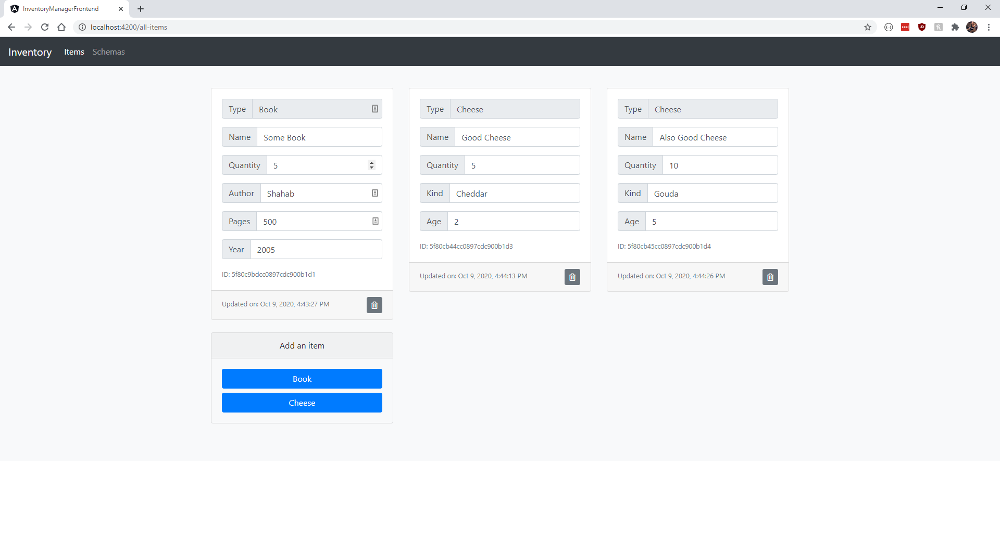

# InventoryManager



Welcome! This is a hobby project of mine. It is an inventory management system that I keep adding features to. Here are some quick notes about it:

  - The project is built using MongoDb, ASP.NET Core 3.1, and Angular 10
  - Item types (referred to as schemas) can be created and customized, then used to create new items (e.g. book, cheese, etc.)

### Installation and Run

The following components need to be installed on the running machine:

  - ASP.NET Core 3.1 SDK and Runtime (https://dotnet.microsoft.com/download/dotnet-core/3.1)
  - NodeJS and npm (https://nodejs.org/en/)
  - MongoDb Community Server (https://www.mongodb.com/try/download/community)
  - Angular CLI (https://cli.angular.io/)

Ensure the `ConnectionString` in `InventoryManager.Api\appsettings.Development.json` points to your local MongoDb installation

Also ensure the `apiUrl` in `InventoryManager.Angular\inventory-manager-frontend\src\environments` points to the locally running backend

Navigate to `InventoryManager.Angular\inventory-manager-frontend` and run the following to install npm packages and serve the angular app

```sh
$ npm install
$ npm start
```

Build and run the .Net Core project using Rider or Visual Studio. (Rider is used for this project's development.)

### Features

WIP

### Upcoming Features

WIP